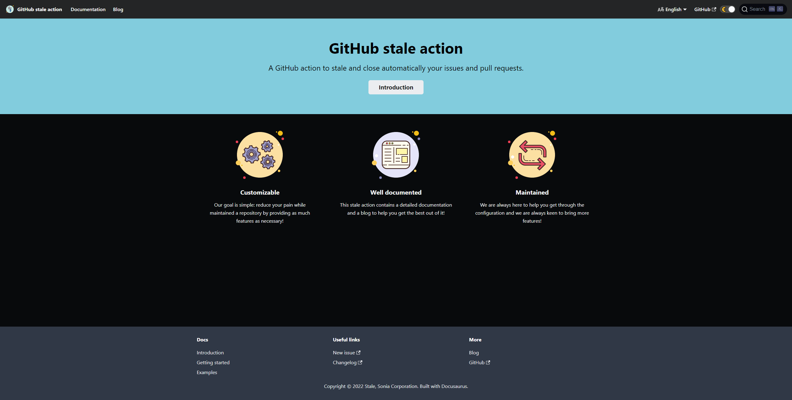
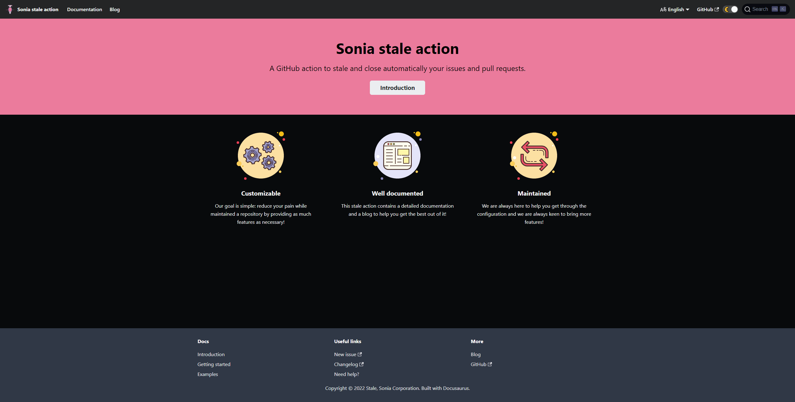

The brand-new UI of the stale action is here, changing the name and the colour palette!

<!--truncate-->

## Re-branding {#re-branding}

In order to keep consistency with the other projects inside the [Sonia corporation organization](https://github.com/Sonia-corporation?type=source), the action name was changed in some places to reflect that it's a "Sonia thing".  
The logo was changed from a thermostat to just the usual Sonia logo.

## Colour palette {#colour-palette}

The previous colour palette was a cold blue, to reflect the "stale" state of the items.  
Now, everything is pink, to follow the dress colour inside the Sonia's logo.

**Before:**

**After:**

We hope you like, and if not, blame Sonia. :wink:
