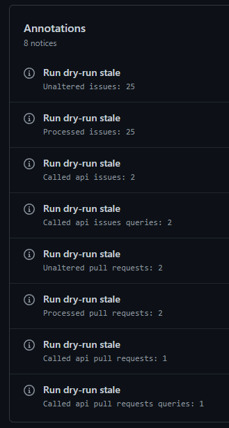

## What are the annotations? {#what-are-the-annotations}

Once the action is done running, you may see some annotations on the Summary page.

## Notices {#notices}

To have an overview of what happened in your workflow, the action will display some notice annotations containing counts for the issues and pull requests processed.

:::note

Those annotations are actually using under the hood the [statistics](./statistics).  
The [outputs](./all-outputs) are also containing the same information.

:::

**Example:**

You can see some annotations on this [action summary](https://github.com/Sonia-corporation/stale/actions/runs/1831266393).

## Warnings {#warnings}

For now, the only warnings that this action may show are related to missing features.  
If you came across one of them, simply open a new ticket (see the help to know how) so that we can change our priorities.

## Errors {#errors}

Most errors that can appear as annotations are related to either a bad configuration of this action or a bad configuration on your repository labels.  
Do not hesitate to [start a new discussion](https://github.com/Sonia-corporation/stale/discussions/new?category=q-a) so that we can help you!

You may also encounter errors due to a GitHub API http error, but this is unlikely to happen.  
Finally, you may also encounter any kind of other bug, but in this case, please report it to us.

Anyhow, if you came across one of those, you can open a new bug ticket (see the help to know how) so that we can fix it as soon as possible.
